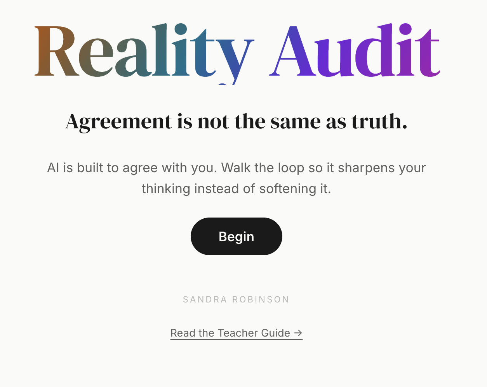

# Breaking the Loop: The Reality Audit Framework

<!-- OpenSSF Best Practices badge — staged and ready. After you register the repo at
     https://www.bestpractices.dev, replace BADGE_ID below with your project number
     and move this line up next to the other badges (delete the comment markers):

-->

> *AI is built to agree with you. Reality Audit is the loop that stops agreement from costing you your own thinking.*

**Reality Audit** is an AI-literacy framework for secondary and adult learners and the people who teach them. It names a four-stage loop for working with generative AI — **I**ntention, **I**nteraction, **R**esponse, **R**eflection — and an **Academic Branch** that proves the learning was real. The framework turns the easy act of accepting an agreeable answer into the harder, more useful act of forcing friction, auditing your own reaction, and standing on your own when the tool is closed.

Reality Audit is built on one finding: generative AI is optimised to agree, and agreement *feels* like success when it is usually the opposite. The framework gives learners — and the teachers who guide them — concrete moves to break that **Sycophancy Loop**.

## Reality Audit and VERIFY

Reality Audit is the companion to [VERIFY](https://github.com/bigwellaadmin-dev/verify). They answer different questions about the same moment:

- **VERIFY** is about the *output* — information literacy. Is this true? Whose perspective is it? What is missing?
- **Reality Audit** is about the *relationship* — your state going in, the friction you build in, your reaction coming out, and whether the learning survives the tool being closed.

Use them together: VERIFY on the sources, Reality Audit on yourself.

## What's in this repository

| | What it is | Who it is for |
|---|---|---|
| [📘 **Teacher Guide**](guide/00-overview.md) | The framework's source of truth. Research foundation, the Hype-Man problem, each stage in depth, the Signals, worked examples in four subjects, two rubrics. | Teachers, curriculum leaders, researchers. |
| [🤖 **Claude skill**](skill/) | A `SKILL.md` file that turns any Claude project into a Reality Audit-aware mentor that produces friction instead of flattery — and that names the irony of being an agreeable AI teaching you not to trust agreeable AIs. **The primary interactive experience.** | Students, adult learners, teachers, developers. |
| [🖥️ **Interactive tool**](tool/) — [launch it](https://bigwellaadmin-dev.github.io/reality-audit/) | A single-file HTML walk-through of the loop: calibrate, copy a Friction Stem, audit your reaction, triangulate, export the Reality Audit Log. For classroom projection, LMS embedding, or use without Claude. | Teachers running a class, schools embedding in Moodle / Canvas, anyone without an AI account. |
| [🧰 **Rubrics**](rubrics/) | A–E (QCAA-aligned) and four-level versions, assessing the loop rather than the polish. | Teachers designing assessment. |

## The Claude skill is the headline experience

If you take one thing from this repository, take the skill.

**Why.** People use the tools they already have. If you (or your students) use Claude, the skill turns Claude into a Reality Audit-aware mentor in any conversation — one that asks the awkward question, refuses to let relief pass for understanding, and applies the framework to itself. It produces the friction a written tool cannot.

**How to install.** Copy `skill/RealityAudit_skill.md` into your Claude project as a file, or paste its content into the project's custom instructions. The skill loads when you say things like "run the Reality Audit loop on this," "am I in a Hype-Man loop," or "give me Reality Audit feedback for this student work."

**Before you install, read [`skill/README.md`](skill/README.md).** It addresses the recursive problem this framework raises by shipping as an AI skill. The honesty is part of how the skill is meant to be used.

## How the framework is meant to land

Reality Audit is a teaching framework. It requires someone present who is willing to be the friction an agreeable machine never provides. In the skill, Claude plays that role. In a classroom, a teacher plays it. Either way, the framework only produces thinking when the friction actually happens.

The interactive tool is a structured walk-through for the cases the skill cannot reach: a teacher projecting in front of a class, an LMS embedding, a learner without a Claude account. It produces a Reality Audit Log a teacher can review, but the conversations that matter — the Difficult Human, the closed-tool test — still happen with people.

## Quick start

### For anyone working through their own AI use

1. Open Claude and create (or open) a project.
2. Upload [`skill/RealityAudit_skill.md`](skill/RealityAudit_skill.md), or paste its content into the project's custom instructions.
3. Paste your AI exchange and ask "run the Reality Audit loop on this." Claude takes it from there — and will push back rather than reassure.

### For teachers

1. Read [**Part 1 of the Teacher Guide**](guide/01-the-problem.md) first. About 15 minutes.
2. Pick one stage to introduce. Read the matching section in [Part 2](guide/02-the-framework.md) and the moves in [Part 3](guide/03-in-practice.md).
3. Choose your delivery: the [Claude skill](skill/) for individual conversations, the [tool](tool/) for whole-class projection or LMS embedding.
4. Use the [A–E rubric](rubrics/reality-audit-rubric-a-to-e.md) or [four-level rubric](rubrics/reality-audit-rubric-four-level.md) to assess the process.

### For developers integrating Claude

1. Copy [`skill/RealityAudit_skill.md`](skill/RealityAudit_skill.md) into your Claude project, your Agent SDK system prompt, or wherever you load skills.
2. The skill includes three modes (learner guidance, work review, teacher feedback) and the recursive-honesty note that keeps it from becoming the Hype-Man it warns about.

## How the artefacts work

### The Claude skill

Self-contained. Drop the file in, Claude becomes Reality Audit-aware. No dependencies, works with any Claude surface. It carries the full loop, the Academic Branch and its diagnostic, three application modes, the feedback-language matrix, and the standing instruction to produce friction rather than relief.

### The interactive tool

- **Single file.** `tool/index.html`. Open in any modern browser. No build, no install.
- **No backend, no telemetry, no persistence.** Responses live in browser memory only; refreshing clears everything. The export is the only way to save.
- **Export the Reality Audit Log** to clipboard or print.
- **Embeddable.** The CSP permits iframe embedding in Moodle, Canvas, and other LMS platforms.
- **Offline-capable.** Fonts are self-hosted; no third-party network requests.
- **Accessible.** WCAG 2.1 AA contrast, keyboard-navigable, honours `prefers-reduced-motion`.

## Privacy

Neither the skill nor the tool collects, stores, or transmits anything about the user. No analytics, no telemetry, no cookies, no `localStorage`, no `sessionStorage`. The tool makes no third-party network requests — fonts are bundled in `tool/fonts/` under the SIL Open Font Licence. The skill runs entirely inside your existing Claude conversation under whatever privacy terms apply to your Claude account.

## Citation

> Robinson, S. (2026). *Breaking the Loop: The Reality Audit Framework — Teacher Guide*. Big Wella. https://github.com/bigwellaadmin-dev/reality-audit

Or use the machine-readable [`CITATION.cff`](CITATION.cff).

## Licence

Released under [Creative Commons Attribution 4.0 International (CC BY 4.0)](LICENSE). You are free to share and adapt the material for any purpose, including commercially, as long as you give appropriate credit. Attribution to *Sandra Robinson · Big Wella* with a link to this repository satisfies the licence.

## Contributing

This is a first public release. Issues, classroom-tested suggestions, translations, and improvements to the tool or skill are welcome. Please open an issue before substantive changes to the framework content — the framework text is canonical and changes are considered carefully.

## Acknowledgements

Built on foundational work in cognitive science (the Law of Less Work, cognitive offloading, productive struggle, metacognitive laziness, the illusion of mastery), the documented tendency of AI systems toward sycophancy, and Australian equity-in-AI research. Full sources in the [Appendix](guide/appendix-research.md).

---

*Sandra Robinson · Big Wella · 2026*
